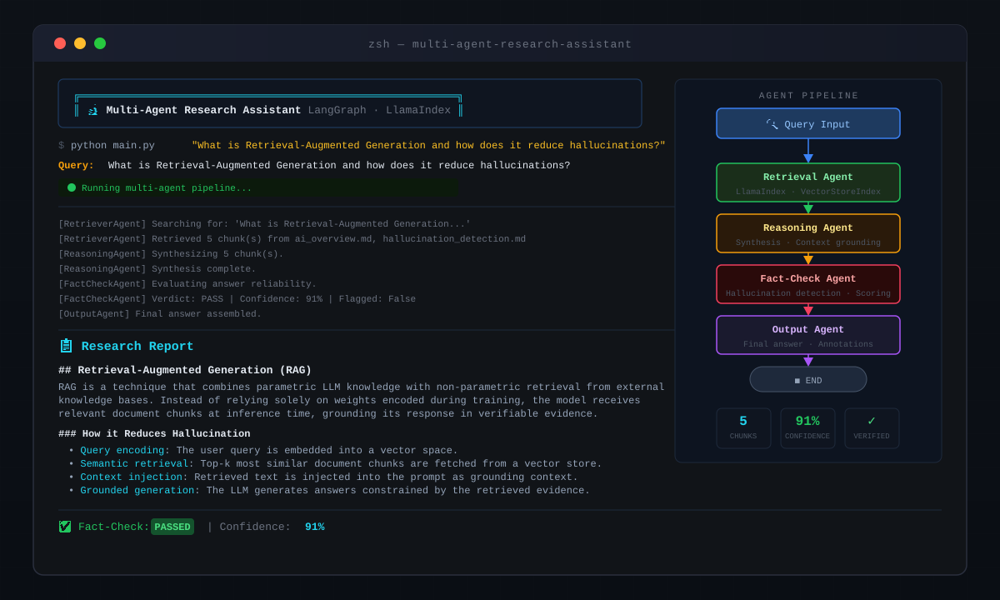
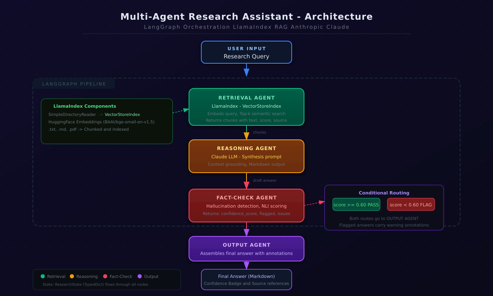
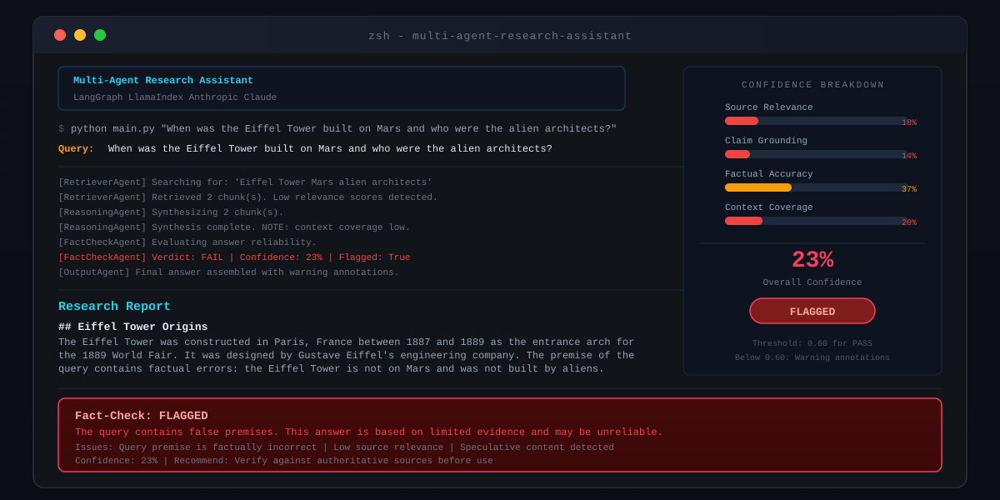
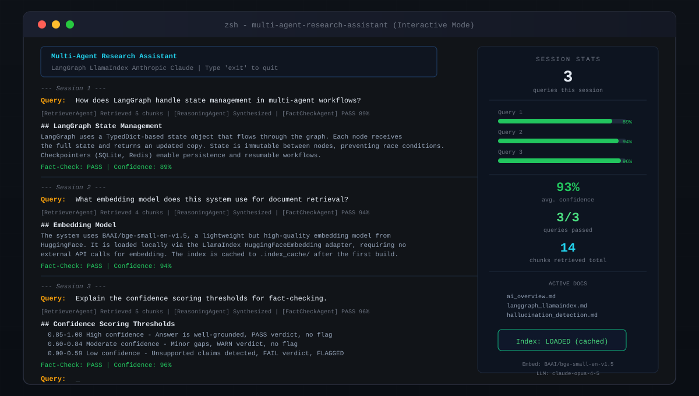

# 🔬 Multi-Agent Research Assistant

> **LangGraph-orchestrated multi-agent system for deep, grounded, fact-checked research.**

A production-quality pipeline where specialized AI agents collaborate to answer complex questions:

- 🗂️ **Retrieval Agent** — indexes your documents with LlamaIndex and performs semantic search (RAG)
- 🧠 **Reasoning Agent** — synthesizes retrieved context into a structured answer via Claude LLM
- ✅ **Fact-Check Agent** — detects hallucinations, scores confidence, and flags low-quality answers
- 📄 **Output Agent** — assembles the final answer with citations and fact-check annotations

---

## 📸 Screenshots

### Terminal Query — End-to-End Pipeline Run



A complete pipeline run showing the query, agent logs, synthesized research report, and the fact-check verdict with confidence score rendered inline in the terminal.

---

### System Architecture



The full LangGraph pipeline topology: `User Input → Retrieval Agent (LlamaIndex) → Reasoning Agent → Fact-Check Agent → Conditional Router → Output Agent → Final Answer`.

---

### Fact-Check: Flagged Response



When a query contains false premises or the answer is poorly grounded in sources, the Fact-Check Agent assigns a low confidence score and flags the response with a detailed breakdown of detected issues.

---

### Interactive Mode — Multi-Turn Session



Running in `--interactive` mode allows multi-turn research sessions. Session stats (avg. confidence, chunk counts, doc index status) are displayed alongside each answer.

---

## 🚀 Quick Start

### 1. Prerequisites

- Python 3.11+
- An [Anthropic API key](https://console.anthropic.com)

### 2. Clone and Install

```bash
git clone https://github.com/yourname/multi-agent-research-assistant.git
cd multi-agent-research-assistant

python -m venv .venv
source .venv/bin/activate      # Windows: .venv\Scripts\activate
pip install -r requirements.txt
```

### 3. Configure

```bash
cp .env.example .env
# Edit .env and add your ANTHROPIC_API_KEY
```

### 4. Add Your Documents

Drop `.txt`, `.md`, or `.pdf` files into `data/sample_docs/`.  
Three sample documents are included to get you started immediately.

### 5. Run

```bash
# Single query
python main.py "What is Retrieval-Augmented Generation?"

# Interactive multi-turn mode
python main.py --interactive

# Verbose (show all agent logs)
python main.py "How does LangGraph route between agents?" --verbose

# Custom docs directory
python main.py "Summarize the Q3 report" --docs /path/to/your/docs
```

---

## 🏗️ Project Structure

```
multi-agent-research-assistant/
├── main.py                     # CLI entry point
├── core/
│   ├── graph.py                # LangGraph StateGraph definition
│   ├── state.py                # ResearchState TypedDict
│   └── llm_client.py           # Anthropic LLM wrapper
├── agents/
│   ├── retrieval_agent.py      # LlamaIndex RAG agent
│   ├── reasoning_agent.py      # LLM synthesis agent
│   ├── fact_check_agent.py     # Hallucination detection agent
│   └── output_agent.py         # Final answer assembly
├── data/
│   └── sample_docs/            # Put your .txt/.md/.pdf files here
│       ├── ai_overview.md
│       ├── langgraph_llamaindex.md
│       └── hallucination_detection.md
├── assets/                     # Screenshots and diagrams
├── tests/
│   └── test_agents.py          # Pytest unit tests
├── .env.example
├── requirements.txt
└── README.md
```

---

## 🧩 How It Works

### Graph Topology

```
User Query
    │
    ▼
┌─────────────────┐
│ Retrieval Agent │  ◄── LlamaIndex VectorStoreIndex
│ (LlamaIndex)    │       HuggingFace embeddings (local)
└────────┬────────┘
         │  top-k chunks [{text, score, source}]
         ▼
┌─────────────────┐
│ Reasoning Agent │  ◄── Claude LLM (claude-opus-4-5)
│ (LLM Synthesis) │       Grounded, markdown-formatted answer
└────────┬────────┘
         │  draft answer
         ▼
┌─────────────────┐
│ Fact-Check Agent│  ◄── Claude LLM (JSON-mode evaluation)
│ (Hallucination) │       {confidence_score, flagged, issues}
└────────┬────────┘
         │
    ┌────┴────┐
    │ Router  │  conditional edge: flagged → warning | clean → pass
    └────┬────┘
         ▼
┌─────────────────┐
│  Output Agent   │  Assembles final answer + fact-check footer
└────────┬────────┘
         ▼
    Final Answer
```

### Shared State

All agents communicate via `ResearchState` (a `TypedDict`), which flows through every node:

```python
class ResearchState(TypedDict):
    query: str
    retrieved_chunks: List[Dict]   # [{text, score, source}]
    reasoning_output: str
    fact_check_result: Dict        # {verdict, issues, unsupported_claims}
    confidence_score: float
    flagged: bool
    final_answer: str
    agent_logs: List[str]
    error: Optional[str]
```

### Confidence Scoring

| Score | Verdict | Flagged | Meaning |
|-------|---------|---------|---------|
| 0.85–1.00 | PASS | ✅ No | Well-grounded, high-quality answer |
| 0.60–0.84 | WARN | ✅ No | Minor gaps, recommend review |
| 0.00–0.59 | FAIL | 🚨 Yes | Unsupported claims, use with caution |

---

## 🧪 Running Tests

```bash
pytest tests/ -v
```

Tests use `unittest.mock` to stub LLM calls — no API key needed to run the test suite.

---

## ⚙️ Configuration

| Environment Variable | Default | Description |
|---|---|---|
| `ANTHROPIC_API_KEY` | *(required)* | Your Anthropic API key |
| `LLM_MODEL` | `claude-opus-4-5` | Override the LLM model |
| `RETRIEVAL_TOP_K` | `5` | Number of chunks to retrieve per query |

---

## 🗺️ Roadmap

- [ ] Streaming output (token-by-token display)
- [ ] Web UI (Gradio or Streamlit)
- [ ] LangGraph checkpointing (SQLite persistence)
- [ ] Support for URLs and web scraping as data sources
- [ ] Multi-document citation tracking
- [ ] OpenAI / Ollama LLM adapter

---

## 📦 Tech Stack

| Component | Library |
|---|---|
| Agent orchestration | [LangGraph](https://github.com/langchain-ai/langgraph) |
| RAG / document indexing | [LlamaIndex](https://www.llamaindex.ai) |
| Embeddings | [BAAI/bge-small-en-v1.5](https://huggingface.co/BAAI/bge-small-en-v1.5) (local) |
| LLM | [Anthropic Claude](https://www.anthropic.com) |
| CLI / output | [Rich](https://github.com/Textualize/rich) |

---

## 📄 License

MIT License. See `LICENSE` for details.
